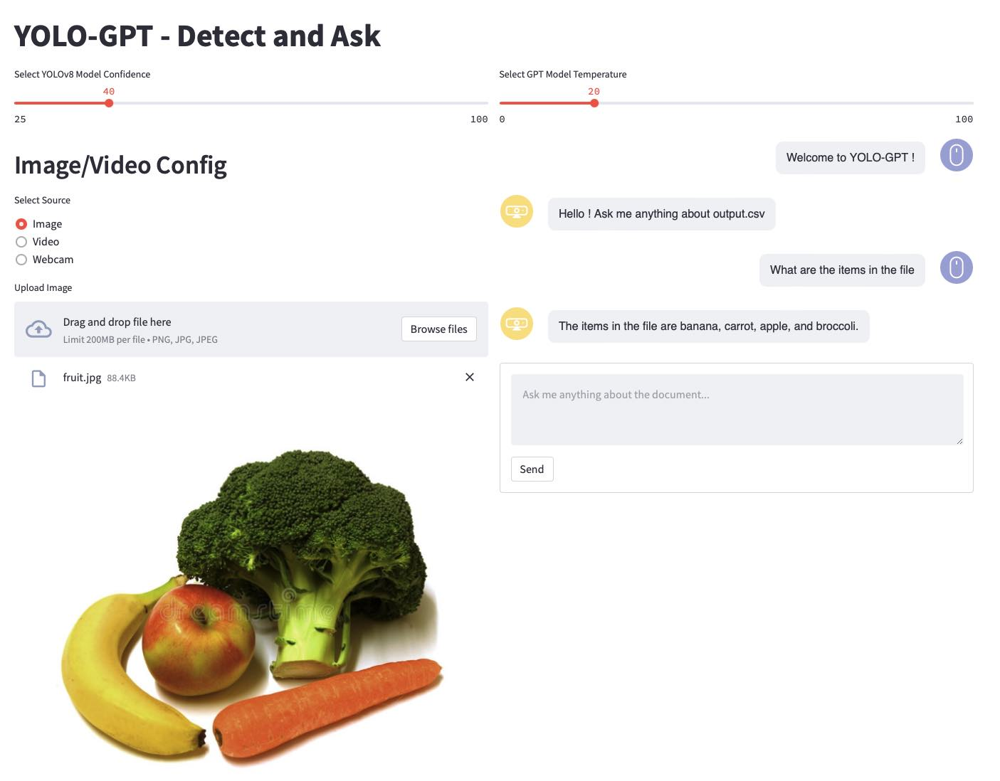

# YOLO-GPT - Detect and Talk
YOLO-GPT is an experimental application showcasing the capabilities of the YOLOv8 and GPT-4 models. The results from the YOLOv8 model are stored and can be used by the GPT-4 model. In a way giving the GPT-4 model "eyes" or the ability to interact with the real world!

## Quickstart
1. Get an OpenAI [API Key](https://platform.openai.com/account/api-keys)
2. Download the [latest release](https://github.com/rabem00/YOLO-GPT/releases/latest)
3. (Optional) Create a virtualenvironment using venv or conda.
4. pip install -r requirements.txt
5. Copy .env-template to .env and fill OPENAI_API_KEY configuration item (or change some other settings).
5. Start using the main application: streamlit run yologpt.py 
6. Open the URL http://localhost:8080

## YOLOv8 models
The YOLOv8 model names are stored in the .env configuration file. By default the small models are used and they are automatically downloaded. There are larger models available and the model names can be found here: https://github.com/ultralytics/assets/releases/ (rename the model names in the .env file).

## Video (.mp4) and image example files
You can find some mp4 video example files here: https://samplelib.com/sample-mp4.html
An example jpeg image can be found in the base of the tree named fruit.jpeg or here https://media.roboflow.com/notebooks/examples/dog.jpeg

## Only Chat or Only Object Detection Applications
There are two apps (only-chat.py and only-od.py) that are only do one thing; chatbox for only-chat.py and object detection for only-od.py. To start run the following: streamlit run only-chat.py or streamlit run only-od.py.

## Todo
* embeddings with additional meta data
* webcam segmentation not working (bug or yolo works this way?)
